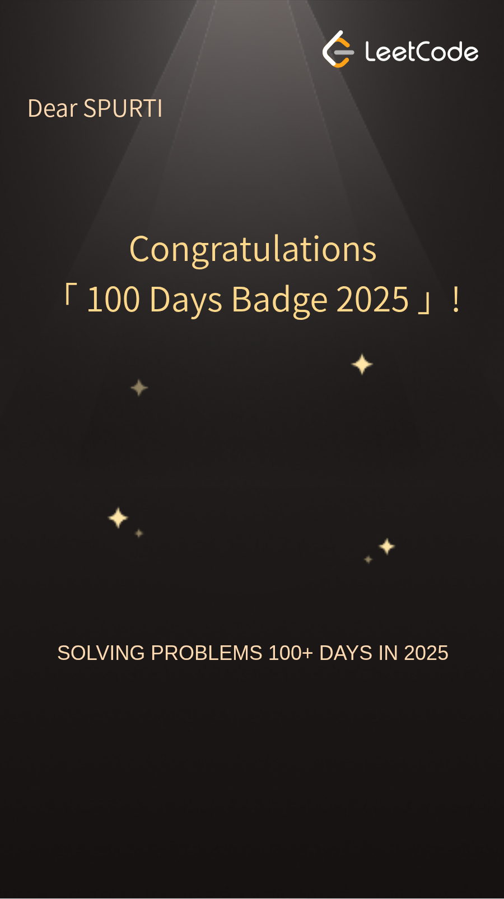
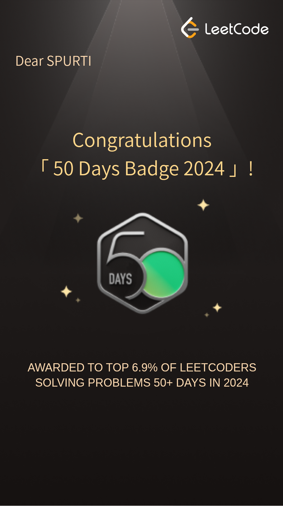
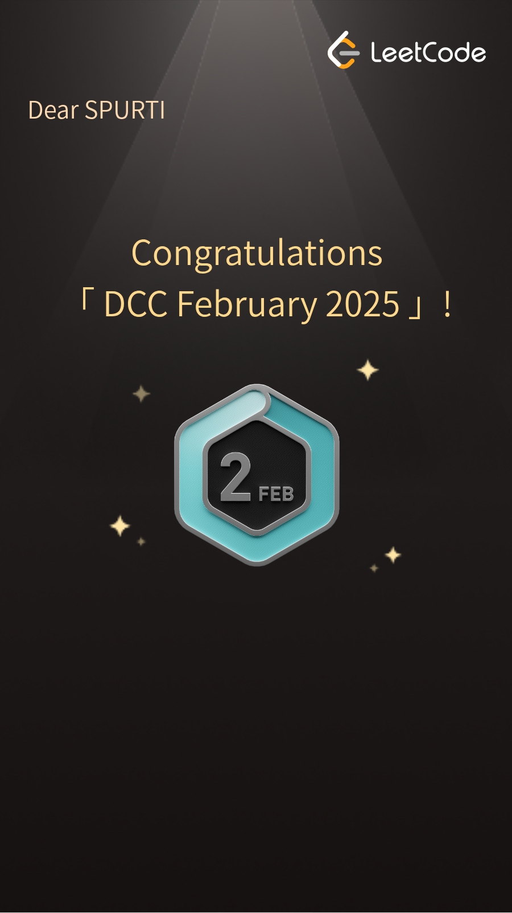
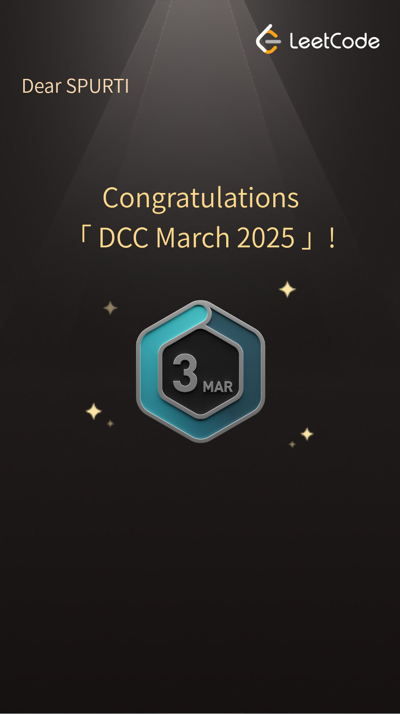
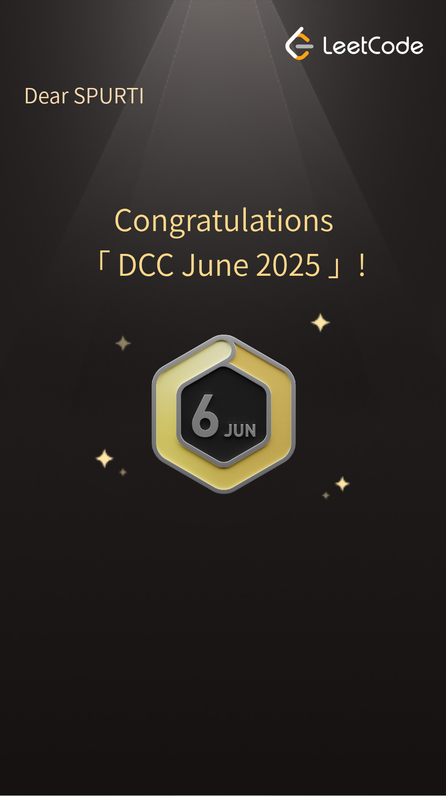

<h1 align="center">Hi 👋, I'm Spurti</h1>

💻 I’m currently interning at <strong>Elektrobit</strong> as a Software Developer Intern

🔭 I’m currently working on a <strong>Large Vision Model for Multi-Modal Crime Scene Analysis</strong>

🌱 I’m currently learning <strong>gRPC</strong> and building a <strong>software module for Mercedes</strong>

👯‍♀️ I’m always on the lookout for exciting collaboration opportunities and eager to learn and explore new technologies! Whether it's a creative project, tech innovation, or anything in between.

📫 How to reach me: <a href="mailto:spurtibhat2004@gmail.com">spurtibhat2004@gmail.com</a>

 
<h1 align="center">Let's Connect!</h1>

 
<h1 align="center">Languages and Tools</h1>

<!-- Languages Section -->

 

<!-- Frameworks Section -->

 

<!-- Tools Section -->

 

<h2 align="center">My LeetCode Badges</h2>

  
  
  
  
  
  

<!-- GitHub Stats Section -->
<h2 align="center">GitHub Stats</h2>

  <!-- Display GitHub Readme Stats -->
  

  <!-- Display Most Used Languages -->
  

